# EasyDelivery
This application explores the seamless process of online delivery, emphasizing collaboration between seller, delivery personnel, and customer for swift and satisfactory transactions.

## Features

-  Simplified Shipping: Smooth package delivery for online stores.
- Tracking: Customers track packages with their phone number.
- Flexible Assignments: Delivery personnel choose their tasks.
- Payment Efficiency: Timely processing for all parties upon delivery.
- Merchant Control: Store owners monitor and cancel deliveries as needed.
- Profile Updates: Merchants and riders can easily update their profiles.
- Admin Management: Administrators can update or delete merchant and rider profiles.
- Financial Oversight: Administrators closely monitor financial details pertaining to specific deliveries.
- Search Functionality: Admins can search for any delivery details.

## Demo

https://www.youtube.com/watch?v=_rlmd79Gw88

## 🔗 Links

## Screenshots

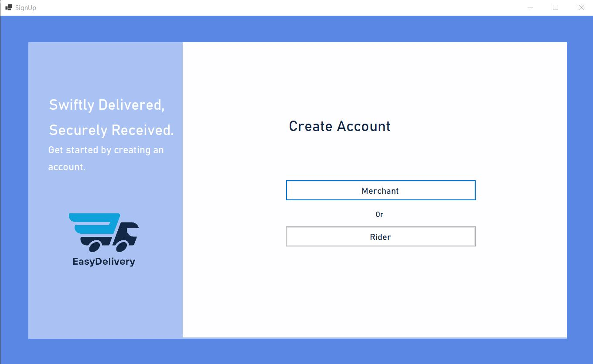
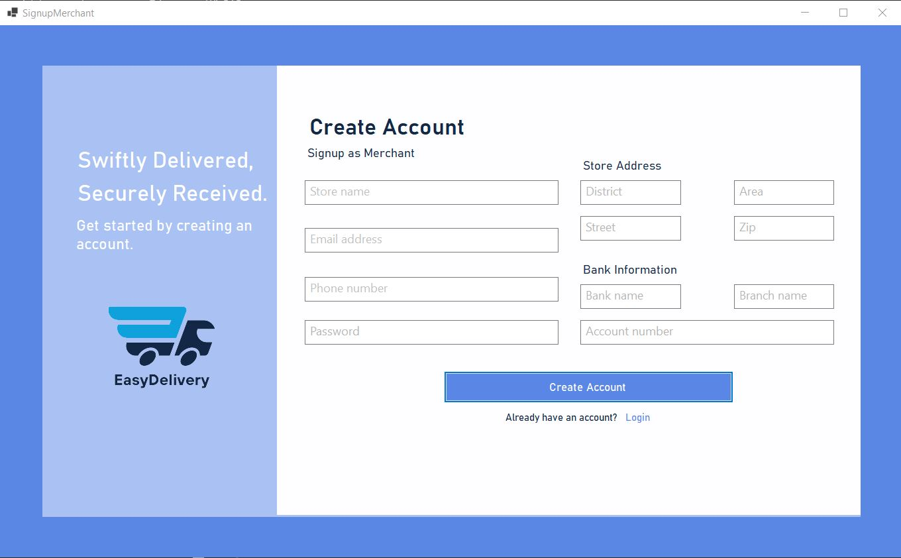
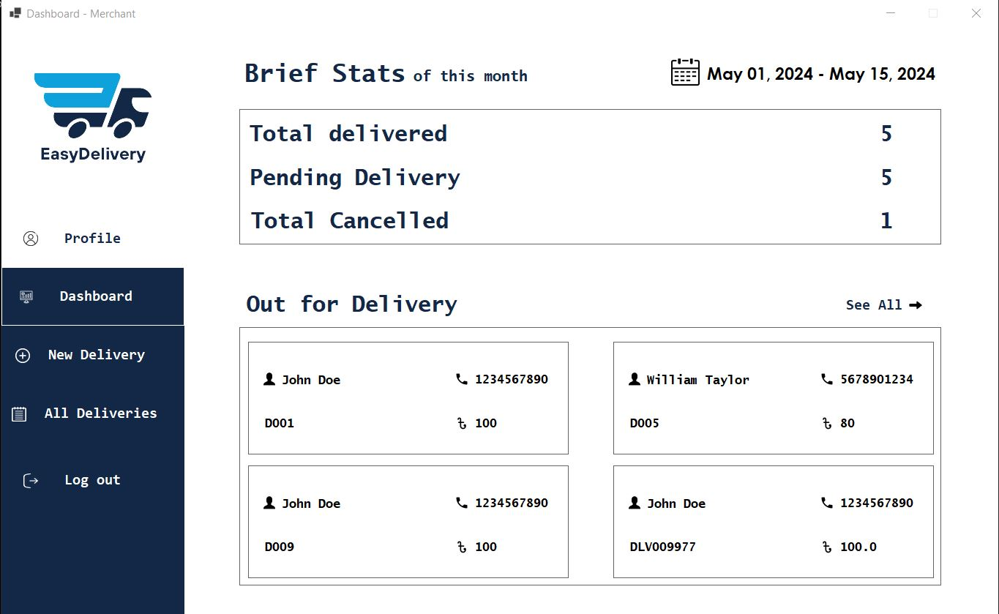
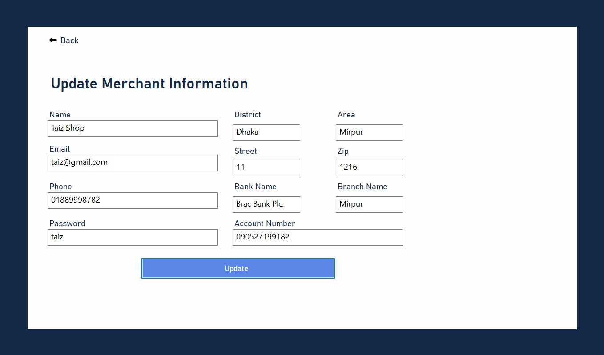
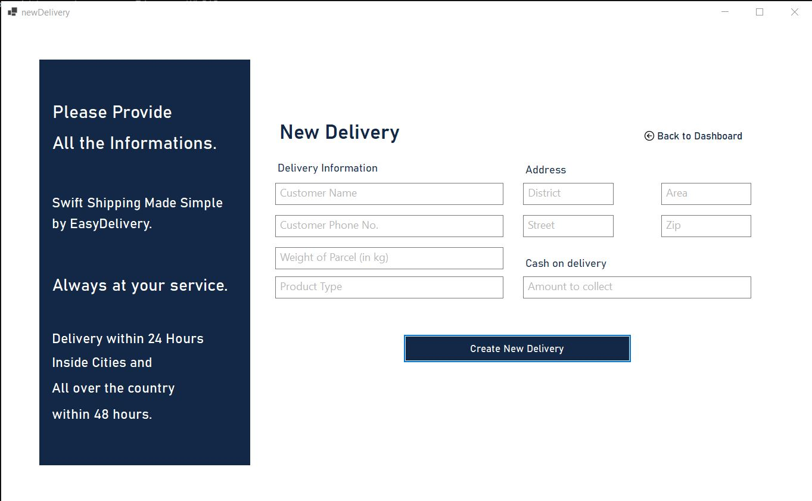
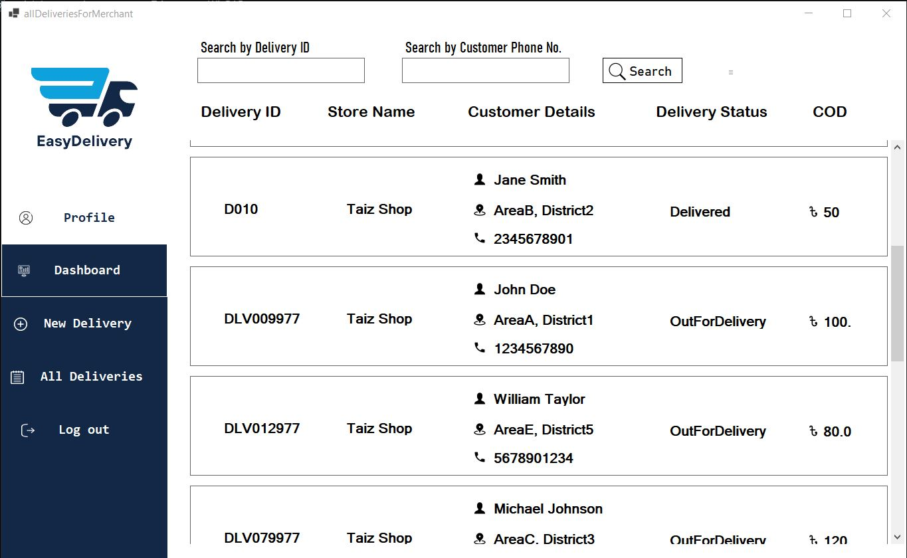
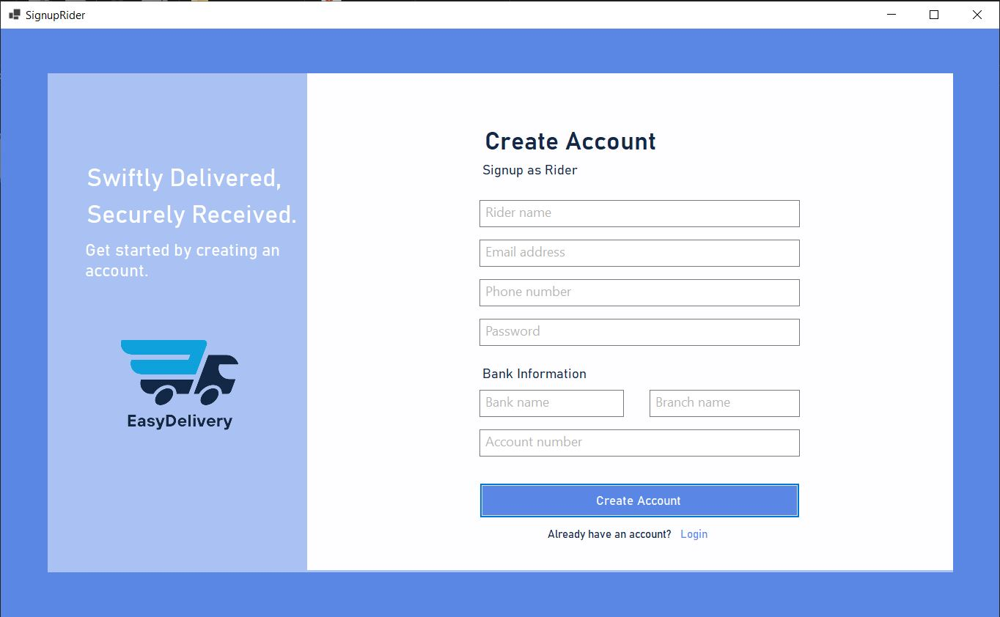
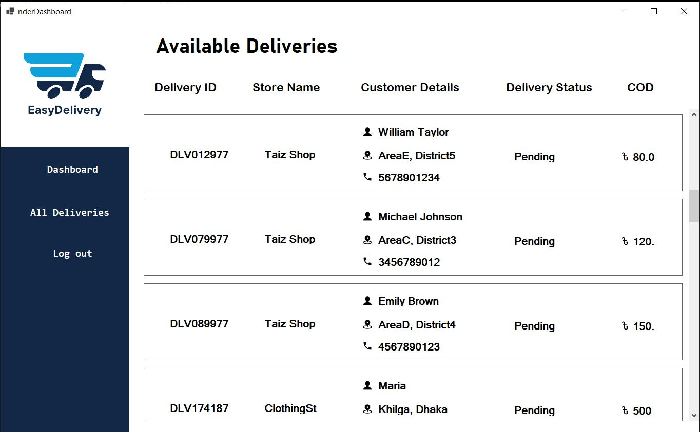
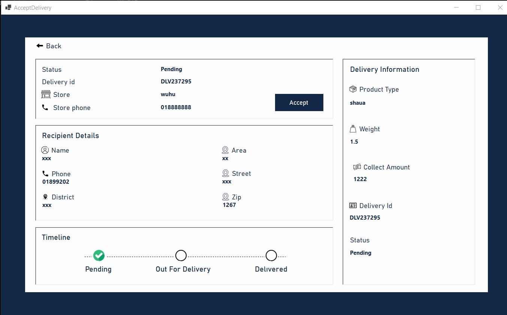
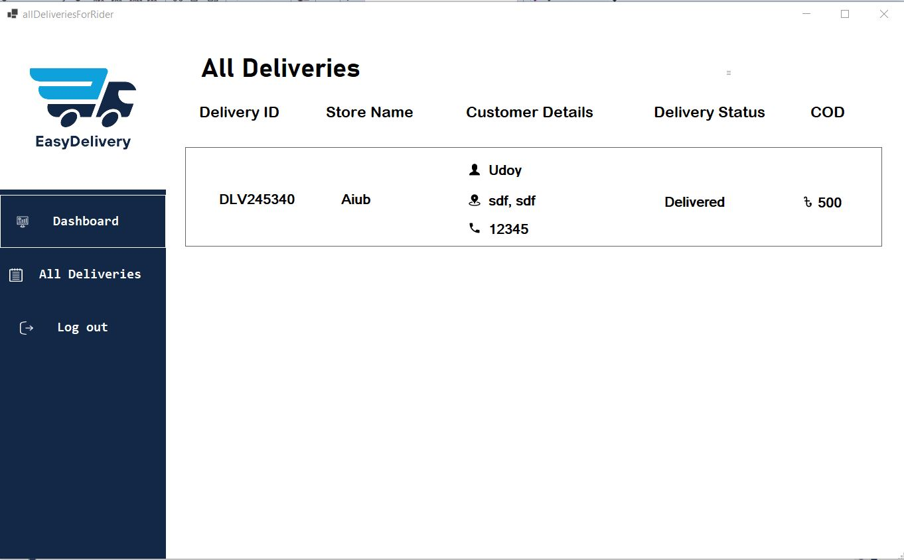
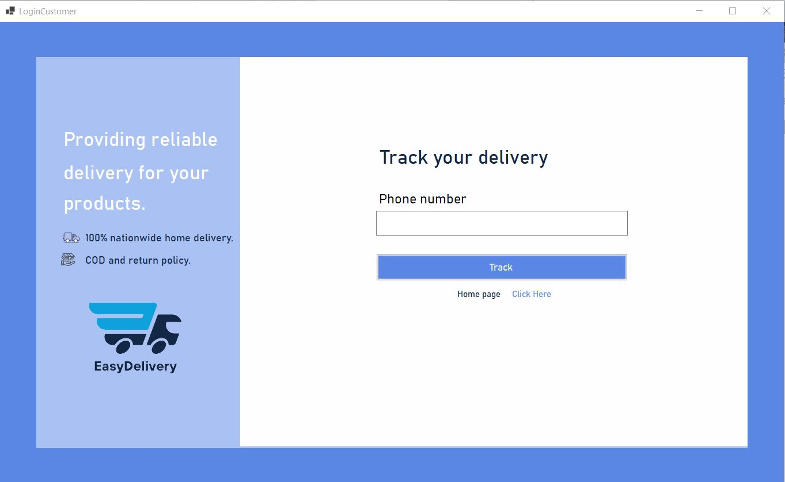
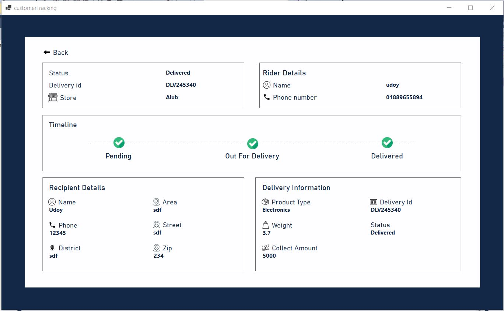
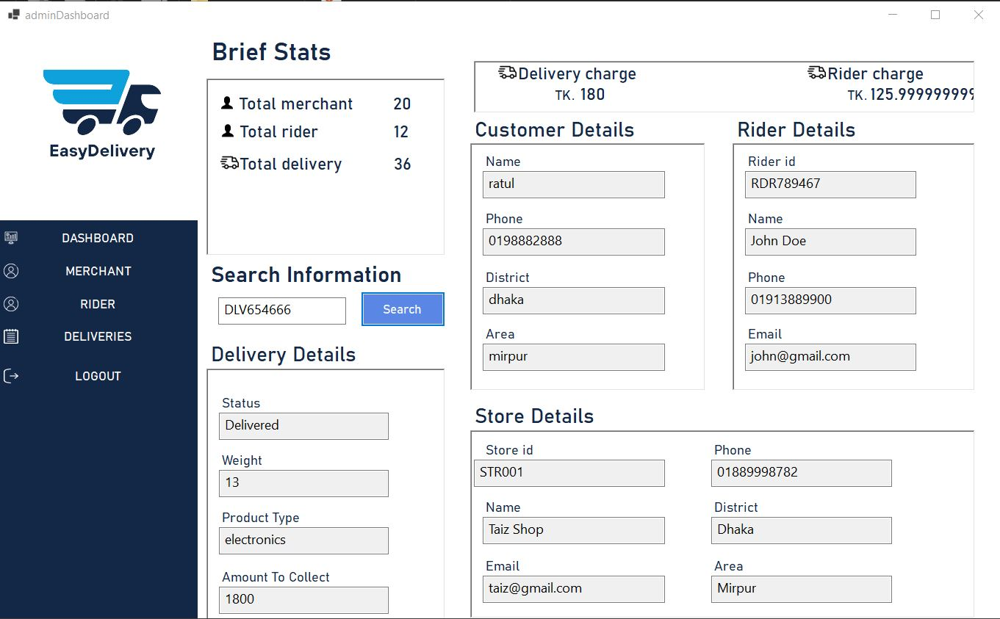
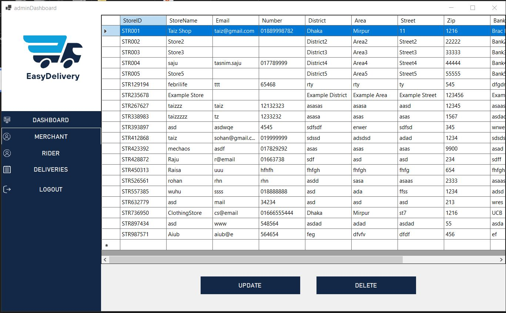
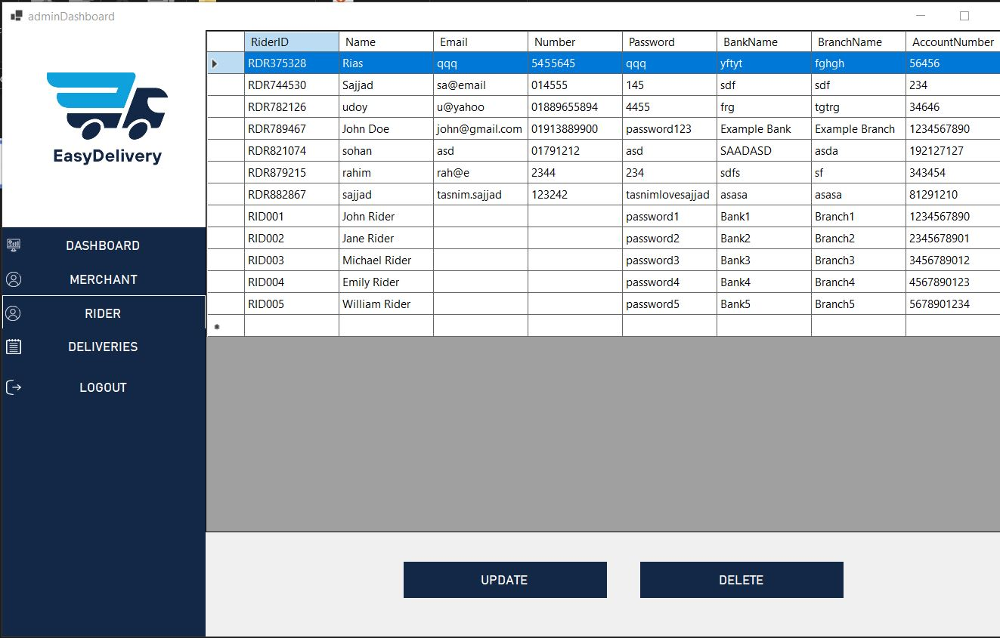
